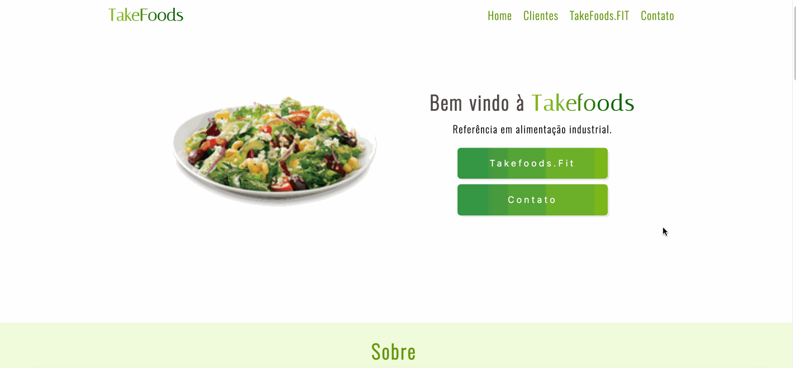
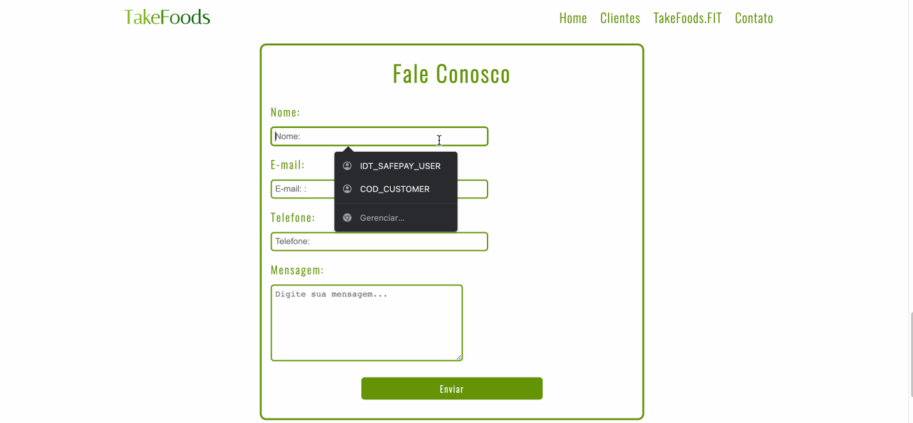

<h1 align="center">Site Takefoods</h1>

<h3>Tabela de conteúdos:</h3>
<a href="#sobre"> - Sobre o projeto</a><br>
<a href="#funcionalidades">- Funcionalidades</a><br>
<a href="#acesso">- Onde posso acessar?</a><br>
<a href="#baixar">- Como posso baixar o projeto?</a><br>
<a href="#tecnologias">- Tecnologias usadas</a><br>

<br>
<br>
<h2 id="sobre">Sobre o Projeto:</h2>
<p>Site 100% responsivo criado para a empresa Takefoods.</p>

<p>Criado com HTML, CSS puro e JavaScript.</p>


<br><br>

<h2 id="funcionalidades">Funcionalidades:</h2>
<p>Algumas das funcionalidades do projeto serão listadas a seguir:</p>
<br>
<h4>- Formulário de contato integrado com o e-mail de contato da empresa:</h4><br>


<h2 id="acesso">Onde posso acessar o projeto?</h2>
<br>
<p>Para visitar o site basta acessar o link: <a href="http://takefoods.com.br">takefoods.com.br</a></p>
<br>

<h2 id="baixar">Como posso baixar o projeto?<h2>

<h4>Para baixar o projeto basta seguir os próximos passos...</h4>
<br>
<h3> - Pré-requisitos:</h3>
<h4>Para clonar o repositório será necessário ter instalado em sua máquina o Git, após isso recomendo utilizar o VSCode para abrir o projeto, mas o editor fica a sua escolha!</h4>
<br>

```bash
#Clone o repositório
$git clone https://github.com/victorpraado1005/site_TakeFoods.git
```

<h4>Após clonar o repositório basta abrir o projeto em seu editor preferido e rodar o projeto.</h4>
<br>
<h4>*Não é necessário instalar nenhuma dependência para rodar esse projeto.</h4>
<br>

<h2 id="tecnologias">Tecnologias do projeto:</h2>
<br>
<h4>Para a criação desse projeto foram utilizadas as seguintes tecnologias:</h4>
<h4> - HTML</h4>
<h4> - CSS</h4>
<h4> - JavaScript</h4>
<h4> - Firebase (Armazenando aceite do aviso de Cookies)</h4>
<br>
<h2>Autor:</h2>
<br>
<h4>Criado por:  <a href="https://github.com/victorpraado1005"> Victor Prado</a>
</h4>
<br>
<h4>Caso queira entrar em contato ou saber mais sobre minhas atividades profissionais basta acessar o meu <a href="https://www.linkedin.com/in/victorprado1005/">Linkedin.</a></h4>
